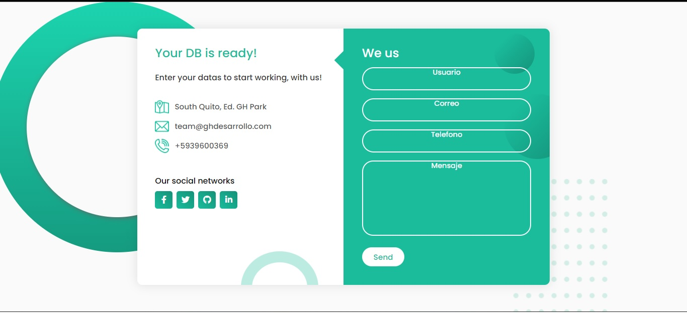
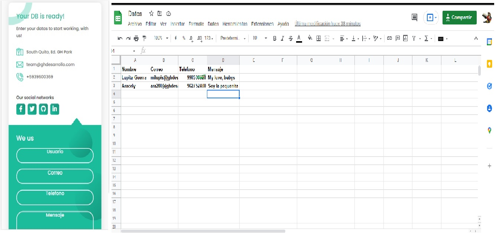

# Formulario_responsive_DB_Google_Sheets
## En este proyecto utilizamos:
**Html5 - Css3 - JavaScript - Google Sheets con Sheet.best - Fontawesome**
* Este formulario responsive permite almacenar los datos ingresados en una plantilla de excel en google sheets *
---

---

